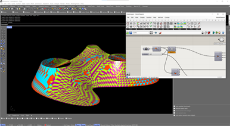

# **Moth - Grasshopper Plugin**

Moth is a plugin for the Grasshopper environment with a variety of useful components.

## **Functionalities**

  Moth is a versatile toolkit designed to address various needs encountered during my years of using Grasshopper. Drawing from my diverse project experiences, this package offers a wide range of functionalities tailored to enhance your workflow.

  Key features include:

  + **Image Metadata Reading:** Easily extract and utilize metadata from images.
  
  + **Urban Grid Generation:** Generate fast urban grid layouts.
  
  + **Graph Tools:** Access a selection of graphing tools for data visualization and analysis.

Whether you're working on architectural projects, urban design, or data representation, Moth can provide useful tools for your workflow.

## **Installation**

  Download the latest release from the Releases page.
  Extract the .gha file to your Grasshopper Libraries folder.

  Restart Rhino and Grasshopper. The Moth plugin will be available in Grasshopper.
  Also it can be directly installed through the Rhino Package Manager.

## **Dependencies**

This plugin relies on the following libraries:

  + Metadata Extractor: Licensed under Apache License 2.0. For extracting image metadata.
  Metadata Extractor library: [Metadata Extractor GitHub Repository](https://github.com/drewnoakes/metadata-extractor)

  + XMP Core SDK: Licensed under Apache License 2.0. For handling XMP metadata.
  XMP Core SDK: [XMP SDK GitHub Repository](https://github.com/drewnoakes/xmp-core-dotnet)

## **License**

  This project is licensed under the MIT License.
  
  Metadata Extractor Library: Licensed under the Apache License 2.0, this library provides functionality for extracting metadata from image files. 
   
  XMP Core SDK: Licensed under the Apache License 2.0, this SDK is used for handling Extensible Metadata Platform (XMP) data. 
  
  The full text of the Apache License 2.0 can be found in the LICENSE file included with this plugin, please refer to the file for detailed license information and ensure compliance with the terms.

## **Issues and Support**

If you encounter any issues or have questions, please report them on the Issues page. For support or feature requests, feel free to reach out.
